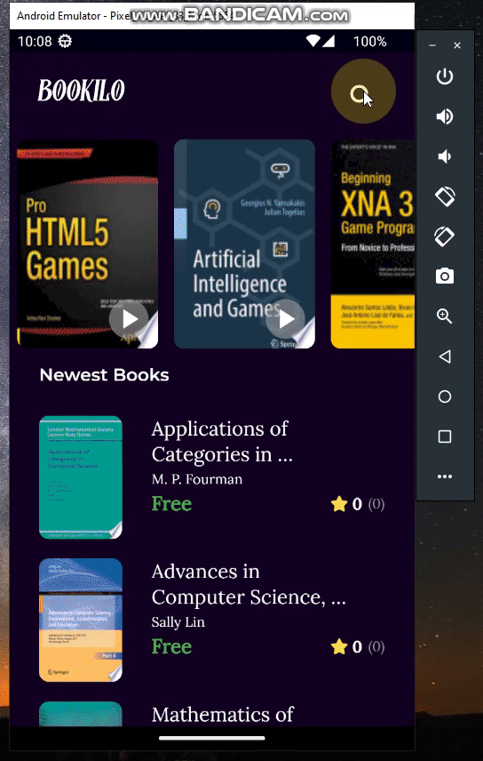

<h1 align="center">Bookilo Clean Architecture</h1>

# ℹ️ Overview
- Used Flutter with BLoC pattern and Clean Architecture to create sample book selling app to search nad view for online books.
- Played with some fancy UI widgets.
- Dependency injection and much much more...

# 📌 Used API

- Free API : https://www.googleapis.com/books/v1/volumes?q=computer-science

# 📱 Screens

